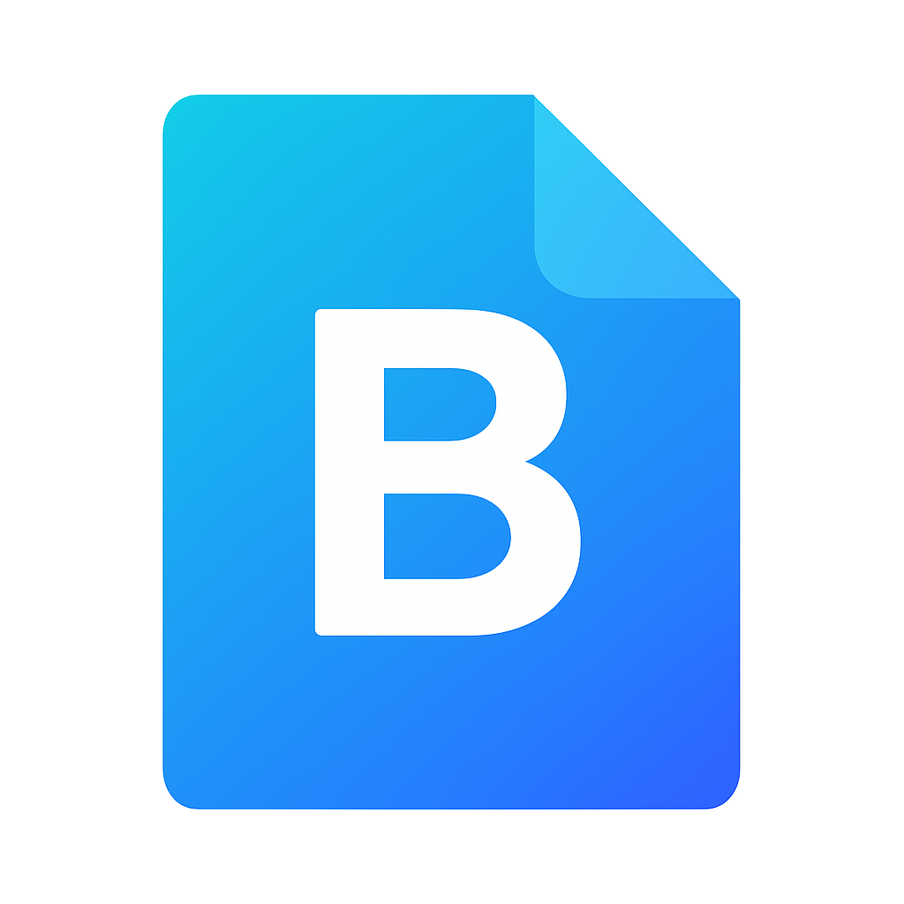

# Bitlet

<p align="center">
  
</p>

<p align="center"><i>Instant clipboard and file sharing via your preferred cloud drive</i></p>

---

**Bitlet** is a minimal, cross-platform utility for quick sharing of clipboard text and files between devices. It uses any cloud-sync folder you choose (iCloud, OneDrive, Dropbox, etc.) and works in the background with global hotkeys.

- Copy a file or text on one device
- Press a hotkey to send it to your cloud-synced Bitlet folder
- Press another hotkey on a second device to fetch it

An iOS Shortcut for mobile integration is coming soon.

---

## 🚀 Quick Start (Windows Installer)

**⚠️ Before You Begin:** Make sure your cloud storage (e.g., iCloud Drive, Dropbox, OneDrive) is already set up and syncing on your computer.

**1. Download & Install**

Grab the latest Bitlet release from the [Releases page](https://github.com/moddog1025/Bitlet/releases). Run the installer and follow the prompts.

**2. Choose Your Cloud Folder**

On first launch, Bitlet will ask you to select the **root folder** of your preferred cloud drive (e.g., iCloud, Dropbox, OneDrive). It will then create a `Bitlet/` directory within it, containing two subfolders: `BitBox/` for current shared content and `BitArchive/` for previously fetched Bits.

**3. Use Global Hotkeys**

| Hotkey             | Action                                |
|--------------------|----------------------------------------|
| `Ctrl + Alt + Z`   | 📤 Upload clipboard to Bitlet          |
| `Ctrl + Shift + Z` | 📥 Retrieve Bitlet contents (clipboard/file) |

- Text gets saved to `TextBit.txt` inside your BitBox.
- Files are saved with original filename inside the BitBox.

**4. Access from Anywhere**

Open the BitBox folder on any synced device to read/download shared content. For iPhone or iPad, a companion Shortcut (coming soon) will simplify this process.

---

## 🛠 Developer Setup (Python)

Want to contribute, tweak behavior, or run Bitlet without the installer?

### 1. Clone the Repo

```bash
git clone https://github.com/moddog1025/Bitlet.git
cd Bitlet
```

### 2. Set Up a Virtual Environment

```bash
python -m venv .venv
.venv\Scripts\activate  # On Windows
```

### 3. Install Dependencies

```bash
pip install -r requirements.txt
```

### 4. Launch in Dev Mode

```bash
python src/bitlet_core/main.py
```

- On first run, Bitlet will prompt you to choose a cloud folder.
- Config files will be stored in:  
  `%LOCALAPPDATA%\BitletApp`

---

## 🧠 How It Works

Bitlet uses your clipboard and keypresses to trigger file/text transfers:

- **Clipboard content** → `TextBit.txt` (for text) or raw file (for files)
- Automatically stored in a shared folder of your choice
- Another device running Bitlet (or an iOS Shortcut) can fetch it instantly

No login, no accounts, no fluff — just fast, direct sharing via your existing cloud ecosystem.

---


**📦 Note:** After a Bit is fetched using the hotkey, Bitlet automatically moves it from the `BitBox/` folder to `BitArchive/` to keep your shared folder clean and prevent duplicate transfers.
## 📁 File Structure

```
bitlet/
├── assets/             # Icons and branding
├── src/bitlet_core/    # Main app logic
├── requirements.txt    # Dependencies
├── pyproject.toml      # Optional packaging config
├── README.md
├── LICENSE
└── .gitignore
```

---

## 🧳 Packaging and Installer (Advanced)

To build Bitlet locally as an `.exe`:

```bash
pip install build
python -m build
```

---


MIT License  
© 2025 Cooper Petit
